# Dreamshaper-methods
 Different sampling methods using Dreamshaper_6 checkpoint.

# Eular A
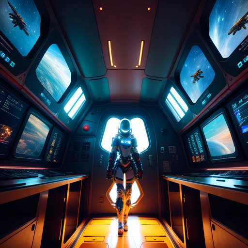.

# DPM++ 2S a
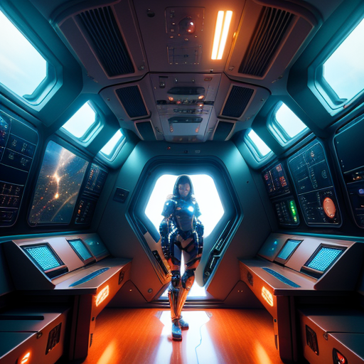

# DPM++ 2M
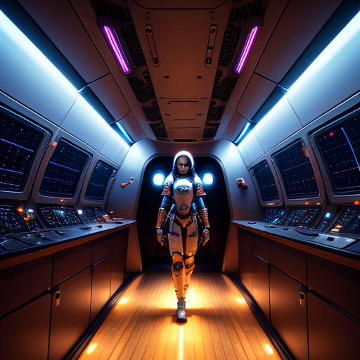

# DPM++ SDE

---------------------------------------------------

# DPM fast (R9 380)

# DPM fast (RX 580)
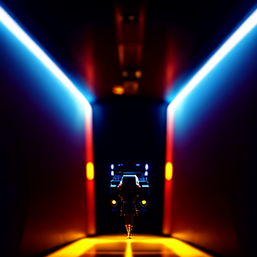

# DPM Adaptive
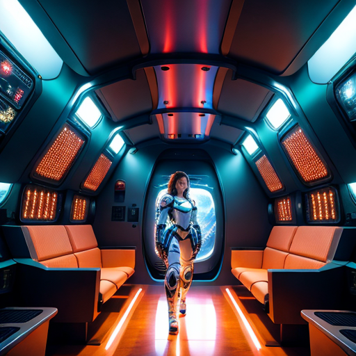

# LMS Karras
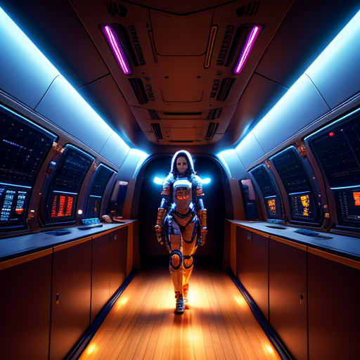

---------------------------------------------------

# DPM2 Karras
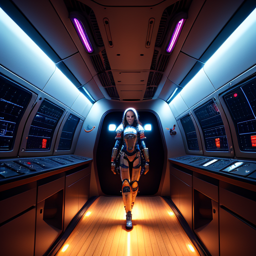

# DPM2 a Karras
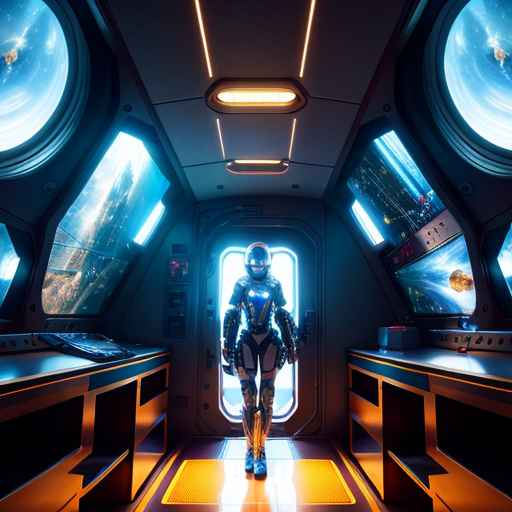

# DPM++ 2S a Karras
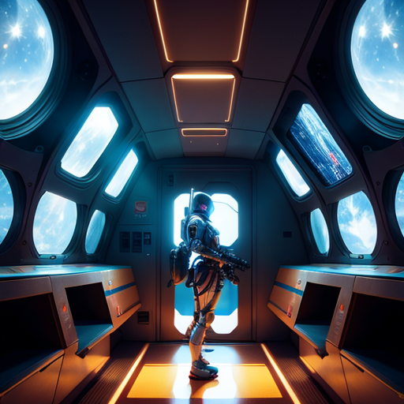

# DPM++ 2M Karras
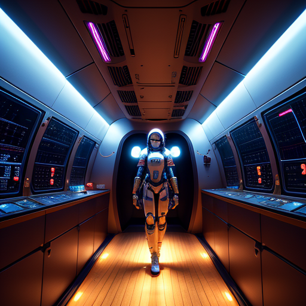

# DPM++ SDE Karras
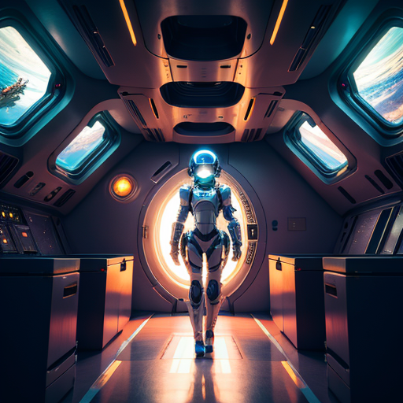

---------------------------------------------------

# DDIM (RX 580)
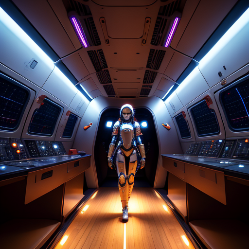

# DDIM (RX 580)

# PLMS
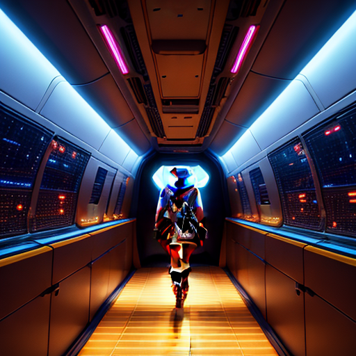

# UniPC
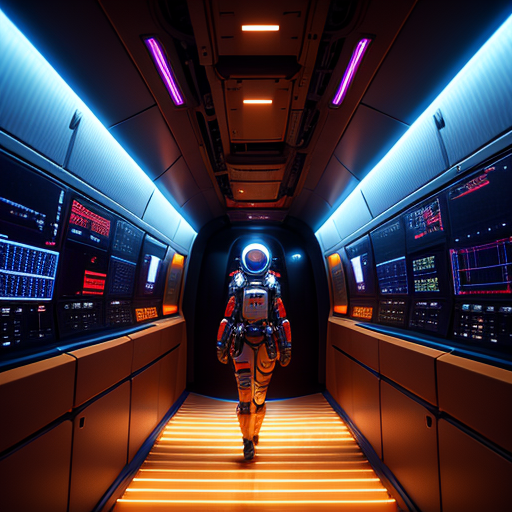

---------------------------------------------------

